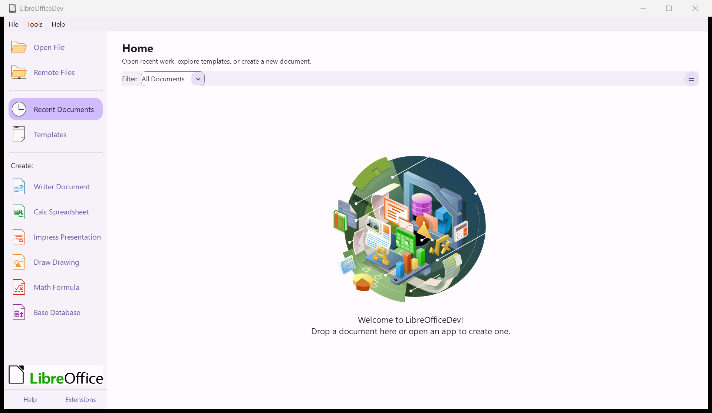
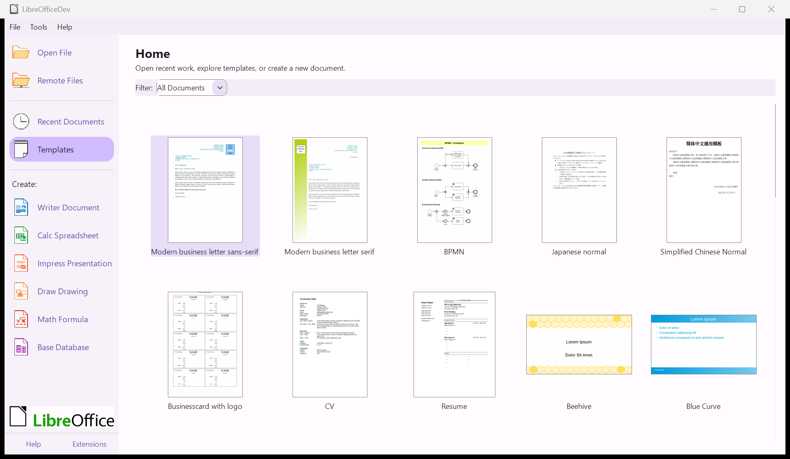
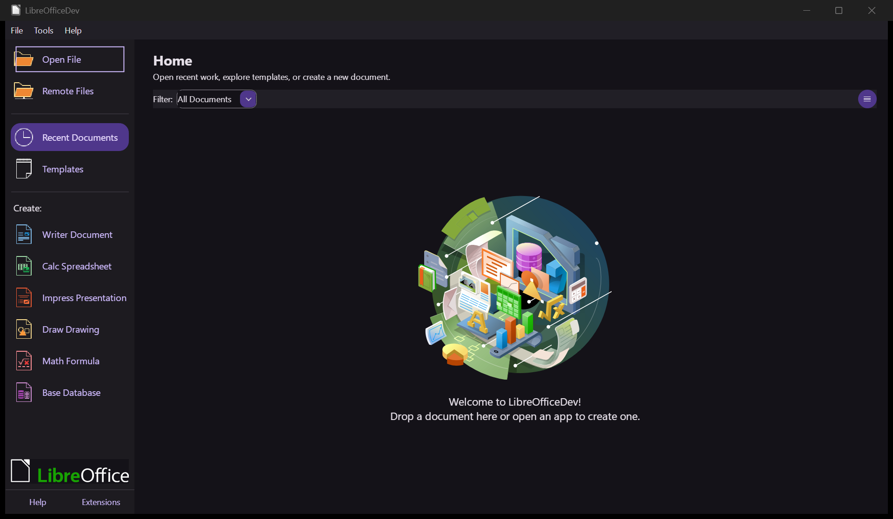
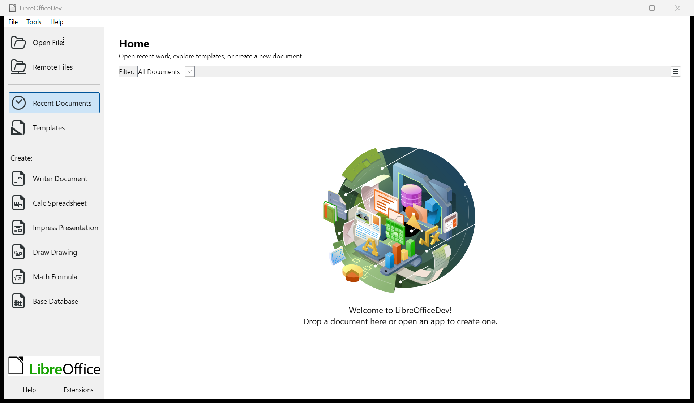

# LibreOffice Material

An experimental LibreOffice engineering fork exploring a suite-wide Material
Design 3 interface while retaining LibreOffice's native implementation stack,
document engine, file-format support, and accessibility foundations.

> **Current development focus: Phase 1 — tenth Material VCL milestone plus a
> post-tenth Start Center and Windows MSI follow-up.**
> Phase 0's full evidence matrix remains open. Semantic
> widget tokens, full-track progress indicators, value-sensitive level
> indicators, native outlined frames, net-less tree connectors, stricter VCL
> definition parsing, broader state coverage, Start Center changes, and a
> consent-based Windows updater are present in source, and the current source
> has passed its five required native C++ targets in Linux Actions run
> [`29695793821`](https://github.com/Ding-Ding-Projects/libreoffice-material/actions/runs/29695793821)
> and in Windows Actions run
> [`29695815101`](https://github.com/Ding-Ding-Projects/libreoffice-material/actions/runs/29695815101).
> That Windows run also completed the full LibreOfficeDev installation-set build
> and the legacy CLI payload check; it did not stage an MSI artifact. A later
> exact-source local build at `577059e2741185b512c184c64685c16d335d10ea`
> completed the same five native targets with Visual Studio 2026, produced a
> 199,692,288-byte Windows x64 MSI, and successfully administratively extracted
> its payload with Windows Installer status `0`.
> The whole GUI has not been rewritten, and no application surface is
> Material-complete. The corrected build is now a normal public, non-draft,
> non-prerelease Latest release at
> [`windows-msi-local-20260720-fbba560e2`](https://github.com/Ding-Ding-Projects/libreoffice-material/releases/tag/windows-msi-local-20260720-fbba560e2).
> It targets exact product source `fbba560e27db26de605c40aa237c554c1f0744b1`,
> contains exactly the MSI plus its checksum and two update manifests, and was
> published on 2026-07-20 at 06:44:07 UTC. Its unsigned 199,688,192-byte MSI has
> SHA-256
> `180e511c065f3e21cd9e4fd0abe31f8886b0cc5ce5ce27a48f2890f83d1afeea`.
> Cache-busted unauthenticated Latest downloads for all four corrected assets
> matched the release sizes and SHA-256 values exactly. A later real Sandbox
> diagnostic found that this release's updater command still mixes
> major-upgrade and repair properties: it detects the old ProductCode but
> `REINSTALL=ALL` prevents the new ProductCode from selecting features. Current
> source removes both `REINSTALL` properties from the update launch while
> retaining both restart-suppression properties; this correction is not yet
> runtime lifecycle proof. The older
> [`577059e274` release](https://github.com/Ding-Ding-Projects/libreoffice-material/releases/tag/windows-msi-local-20260720-577059e274)
> remains historical because its updater launch forwarded only four of five
> generated arguments and omitted `REBOOT=ReallySuppress`; do not treat that
> older release as restart-suppression or updater-runtime proof. The earlier hosted run
> found a staging-rule defect after building the MSI:
> recursive discovery included two retained intermediate MSI databases alongside
> the final package. The workflow now scopes discovery to the final success-only
> `install\en-US` directory. The local MSI is unsigned, and the local wrapper's
> parent process exited after successful extraction but before final dist
> staging. Current source now launches administrative extraction through a
> safely quoted, hidden `Start-Process -Wait` client and validates that invariant
> under PowerShell 5.1/7. Exact implementation commit `7029dccf4` then passed
> all five required VS 2026 native targets, the full product/MSI build, waited
> administrative extraction, and canonical MSI/checksum/manifest staging, which
> closes the local wrapper gate.
> Real LibreOfficeDev Start Center runs from the corrected extracted MSI payload
> are now the canonical gallery evidence: three light, three dark, and three forced-
> high-contrast captures with nine matching bounded UNO trees and no collector
> errors. Each appearance profile proves one keyboard Tab focus transition to the
> accessible `Open File` button. The separate interactive
> [design reference](https://ding-ding-projects.github.io/libreoffice-material/prototype.html)
> is a mockup, not the app. To run the actual editor, install upstream LibreOffice
> from [libreoffice.org](https://www.libreoffice.org/download/), which does not
> include these Material changes. An automated pipeline
> ([`build-installer.yml`](.github/workflows/build-installer.yml)) attempts a
> Linux build, while [`windows-installer.yml`](.github/workflows/windows-installer.yml)
> now starts a Visual Studio 2022/Cygwin Windows x64 MSI build on every `main`
> push (manual dispatch remains available). Both publish **only** after genuine
> packages pass structural validation. Run `29695815101` at
> `e4dc8a850c982f33d8722fc203f86591b2993e8b` proves the repaired CLI payload,
> required native targets and full installation-set build. The local VS 2026
> run adds exact-source MSI, Start Center smoke, and bounded UNO-tree evidence.
> The corrected normal release and its public Latest asset bytes are verified,
> but updater-runtime and MSI lifecycle proof are not accepted yet.
> Hosted Windows publication for the newest pushed source is still running; the
> exact local VS 2026 result below is not yet a hosted release.

[Project site](https://ding-ding-projects.github.io/libreoffice-material/) ·
[Interactive preview](https://ding-ding-projects.github.io/libreoffice-material/prototype.html) ·
[Roadmap](ROADMAP.md) ·
[Windows UI inventory](docs/WINDOWS_UI_INVENTORY.md) ·
[Canonical Windows rewrite contract](docs/design/00-windows-rewrite-contract.md) ·
[Material specification](MATERIAL_DESIGN.md) ·
[Full design spec](docs/design/README.md) ·
[Headless UI evidence plan](docs/HEADLESS_UI_EVIDENCE.md) ·
[Screenshot index](docs/SCREENSHOTS.md)

**[Download the latest Windows x64 MSI](https://github.com/Ding-Ding-Projects/libreoffice-material/releases/latest/download/LibreOfficeMaterial-Windows-x64.msi)** ·
[Release details](https://github.com/Ding-Ding-Projects/libreoffice-material/releases/tag/windows-msi-local-20260720-fbba560e2)

## What is true today

| Area | State | Evidence |
| --- | --- | --- |
| LibreOffice source baseline | Imported | This repository's initial tree matches upstream commit `63584e7f9f0cdc74b0e004bcbf88e5c3b42dba21` |
| Material design direction | Initial specification | [`MATERIAL_DESIGN.md`](MATERIAL_DESIGN.md) |
| Material VCL implementation | Tenth milestone plus a native-test-backed Start Center follow-up | Light/dark profile routing, complete semantic `StyleSettings` color mapping, native-preserving type roles, semantic shape/metric roles, full-track progress and value-sensitive level indicators, native outlined frames and net-less tree connectors, disabled-affordance state completeness, strict source validation, high-contrast fallback, shared renderer fixes, and Start Center source changes are present. The standard `suggested-action` UI class reaches `PushButton::setAction(true)` through `VclBuilder`, selecting the existing Material `extra="action"` states. Exact source `393263ad9` removes the bottom Donate action and leaves Help/Extensions in the footer; its focused 6-test validator, VS 2026 product build, native regression phase, MSI extraction, light UI smoke, and bounded accessibility capture pass |
| Whole-suite implementation | Incomplete | Phased work remains in [`ROADMAP.md`](ROADMAP.md); the 105-row [`Windows UI inventory`](docs/WINDOWS_UI_INVENTORY.md) records the owner, current evidence, missing gates, and stable acceptance IDs for every named Windows surface |
| Canonical rewrite coverage | Contracted; implementation in progress | The operator-provided design ZIP is pinned by hash in the [`Windows rewrite contract`](docs/design/00-windows-rewrite-contract.md). Its eleven surfaces govern the native Windows rewrite. After removing two automatic prompt dialogs, fail-closed registries track all 597 remaining top-level LibreOffice dialog roots and 26 audited shipping text-query fields plus one planned Start Center search. Current native source adds one centralized Windows-only final-layout hook that bottom-right positions `Dialog` instances inside the visible owner/work area; this is placement infrastructure, not the customizable form host, manager/history, per-field regex integration, build, or runtime completion |
| Verified UI screenshots | 9 canonical Start Center captures: 3 each in light, dark, and forced high contrast | Exact build `393263ad9` supplies Help/Extensions-only Home/focus/Templates trios in [`light`](docs/evidence/runs/20260720-143309-393263ad92-windows-headless-light/), [`dark`](docs/evidence/runs/20260720-144200-393263ad92-windows-headless-dark/), and [`forced high contrast`](docs/evidence/runs/20260720-144249-393263ad92-windows-headless-highcontrast/). Every current canonical screenshot omits the retired footer Donate control. Earlier runs remain historical proof; scaling, accelerated rendering, localization, and suite surfaces remain open |
| Headless harness | Light/dark/high-contrast UI, keyboard focus, and bounded UNO collection passed | The sibling low-level driver launched the exact MSI payload on run-scoped off-screen desktops, resolved stable runtime ownership, captured nine canonical states, drove background pointer and Tab input in every appearance profile, collected nine bounded UNO trees with no collector errors, shut down normally, and left zero matching processes/windows. All three current canonical runs used dedicated same-token MCP sessions so UNO and the GUI shared the same integrity boundary; see [`docs/HEADLESS_UI_EVIDENCE.md`](docs/HEADLESS_UI_EVIDENCE.md) |
| Interactive design reference | Published mockup | [`site/prototype.html`](site/prototype.html) — all 11 suite surfaces, customizable bottom-right dialog/notification forms, bulk manager, recoverable local Git-style ledger, and one documented advanced regex builder shared by all five prototype search surfaces; guarded by [`bin/validate-prototype.mjs`](bin/validate-prototype.mjs) (9/9) and the `prototype-check` CI |
| Windows updater | Protected staging and no-restart source regressions pass; end-user flow not yet exercised | Windows-only update source reads the exact GitHub Latest XML asset, rejects untrusted or legacy state, verifies the canonical MSI metadata and bytes, stages through protected LocalAppData, and requires default-No consent before a visible install. Current source launches a major update with exactly `/i`, the staged MSI, `REBOOT=ReallySuppress`, and `MSIRESTARTMANAGERCONTROL=DisableShutdown`; repair-only `REINSTALL` properties are excluded. Its regression suite covers this four-argument vector, exclusive `CREATE_NEW` staging, the SYSTEM/Administrators/Owner Rights DACL, and a retained read lock that rejects write/delete opens. Download/consent/visible-launch and real MSI lifecycle proof remain pending; see [Privacy](PRIVACY.md) |
| Installer / release | Local exact-source MSI/package gate and earlier normal Latest release verified | Exact implementation commit `393263ad924eae8d64b4f9a35bd6486ef83578fc` passed the full VS 2026 product build, the five-target native regression phase, MSI staging, and administrative extraction. Its unsigned 199,651,328-byte MSI is `7e8b1057…00e9`, embeds the exact build ID, contains one `soffice.exe`, and packages a Start Center without the retired footer Donate widget. The public, normal, non-draft, non-prerelease Latest release remains `windows-msi-local-20260720-fbba560e2`; it predates this UI change and the current four-argument updater and is not lifecycle proof. A statically validated [Windows Sandbox lifecycle harness](qa/windows-installer-lifecycle/README.md) pins the old/corrected packages and requires exact-zero install/update/repair/uninstall results with `/norestart`, `REBOOT=ReallySuppress`, unchanged reboot indicators, and clean uninstall. Three isolated launches failed closed; the third proved the Upgrade table found the old ProductCode but repair-only `REINSTALL` properties selected no features and skipped removal. Current source corrects that command split; a fresh acceptance run remains open. Hosted publication also now accepts GitHub's temporary draft URL before promotion while continuing to require the canonical tag URL after publishing; exact pushed-run verification remains pending |

This table is deliberately conservative. A roadmap item changes state only when
its code, build result, interaction checks, and committed visual evidence agree.

## Running Windows app — exact-source VS 2026/MSI evidence

<p align="center">
  <a href="docs/evidence/runs/20260720-143309-393263ad92-windows-headless-light/screenshots/start-center-light.png"></a>
  <a href="docs/evidence/runs/20260720-143309-393263ad92-windows-headless-light/screenshots/start-center-light-keyboard-focus.png"></a>
  <a href="docs/evidence/runs/20260720-143309-393263ad92-windows-headless-light/screenshots/start-center-templates-light.png"></a>
</p>

<p align="center">
  <a href="docs/evidence/runs/20260720-144200-393263ad92-windows-headless-dark/screenshots/start-center-dark-keyboard-focus.png"></a>
  <a href="docs/evidence/runs/20260720-144249-393263ad92-windows-headless-highcontrast/screenshots/start-center-highcontrast-keyboard-focus.png"></a>
</p>

These are unedited `1920×1117` captures of actual Windows binaries. The light
trio comes from the MSI built at exact source commit `393263ad924eae8d64b4f9a35bd6486ef83578fc`
and visibly proves the Help/Extensions-only footer. The dark and
forced-high-contrast trios come from that same exact build and prove the same
footer contract. Each run used the Material
file-widget opt-in and software-raster fallback because the default-GPU
`PrintWindow` path produced a preserved blank capture. The canonical light run proves
stable launch, visible Start Center rendering, one background Tab transition,
and background navigation to Templates. Its three nonempty bounded UNO trees
contain 93/46, 93/46, and 108/61 total/visible nodes with no collector errors or
partial capture; `Open File` is the single `FOCUSED` node at the focus checkpoint.
It also proves normal shutdown and clean desktop/driver disposal. The dark and
forced-high-contrast runs repeated Home/focus/Templates and passed the same
cleanup gates; their [dark manifest](docs/evidence/runs/20260720-144200-393263ad92-windows-headless-dark/manifest.json)
and [high-contrast manifest](docs/evidence/runs/20260720-144249-393263ad92-windows-headless-highcontrast/manifest.json)
bind every PNG to its tree. This still does not prove accelerated rendering,
scaling, localization, updater behavior, or the whole-suite matrix. It also does
not execute MSI install, repair, upgrade, uninstall, or restart-suppression
lifecycle scenarios. See the
[canonical light manifest](docs/evidence/runs/20260720-143309-393263ad92-windows-headless-light/manifest.json),
[results](docs/evidence/runs/20260720-143309-393263ad92-windows-headless-light/results.json),
and [screenshot registry](docs/SCREENSHOTS.md). The canonical image SHA-256
values are `c339a8516ca84489f3a96b53cf63b5e448692cc327c3a7683622d2fa64f5ee84`
for Home/Recent Documents, `b799b696902744cbb80be340c6319cfa899308031d019bddfa6cd06d2476427b`
for keyboard focus, and
`11e3762201ee5b8e516a4cd32b94092491269e1c9415d4d8c181feaa97fc759c`
for Templates. The former canonical corrected light pair under
[`20260720-022159-fbba560e27-vs2026-msi-raster-restart-suppression`](docs/evidence/runs/20260720-022159-fbba560e27-vs2026-msi-raster-restart-suppression/)
and the earlier accepted `577059e274` software-raster pair remain historical proof.

## Material VCL source milestones

The implementation is intentionally opt-in and shared-layer first. The current
source includes:

- a packaged `material/definition.xml` file-widget theme with matching light and
  dark palettes of 23 semantic color roles each, 79 definition-backed parts,
  and 205 component states;
- eight semantic corner roles resolved order-independently by the native XML
  reader into both existing rectangle radius axes; all 159 rounded Material
  rectangles use one named role while the 11 square rectangles remain
  attribute-free, and legacy numeric `rx`/`ry` definitions stay supported;
- 15 semantic native integer metric roles for strokes, control dimensions,
  spacing, tab/title heights, and list-preview geometry; 346 integer values now
  resolve through those roles—307 drawing strokes, 34 explicit part
  dimensions/margins, and 5 numeric settings—while the existing native action,
  part, and settings representations remain unchanged;
- all 684 normalized `x1`/`y1`/`x2`/`y2` coordinate values remain local
  literals because they describe proportional component geometry rather than
  integer metrics; typography scaling and rectangle corners retain their
  separate semantic contracts;
- an exact 72-slot Material style contract that closes the ten previously
  native-dependent accent, list-box collection, alternating-row, warning, and
  error colors; these newer reader fields remain optional so partial legacy and
  out-of-tree file themes preserve native values when a role is omitted;
- typed `body`, `label`, and `title` roles with bounded relative scaling and a
  strict minimum-weight vocabulary; each role copies the captured platform font,
  applies the declared nonshrinking height scale, and only raises weight to the
  declared minimum, so family, style, charset, language, pitch, orientation,
  width, and icon fonts remain native;
- order-independent color, shape, and metric `@token` resolution and strict
  rejection of malformed colors, shapes, or metrics, invalid or duplicate token
  sections, mismatched palette schemas, unknown references, ambiguous radius
  declarations, and unknown or duplicate control parts; older bundled and
  out-of-tree definitions retain their existing literal numeric geometry path;
- selection through `VCL_FILE_WIDGET_THEME`, with a restricted safe theme name,
  shared immutable definitions, and a mutex-protected cache keyed by theme and
  resolved light/dark scheme; a failed request attempts `online`, which is not
  packaged in this imported desktop tree, and otherwise leaves the file theme
  inactive;
- native settings collected and captured before the opt-in Material pass, with
  the resolved precedence high contrast over dark over light; high contrast
  restores the pre-Material style/framework baseline and delegates to native or
  generic forced-color drawing;
- runtime profile transitions recompute native-focus suppression for buttons,
  tabs, and list boxes so generic fallback retains a visible VCL focus
  indicator; Qt proxy styles preserve their high-contrast signal, and headless
  VCL honors an explicitly selected dark appearance;
- definition-aware support reporting so parts absent from the selected file
  theme stay on their existing fallback path;
- expanded mixed, disabled, hover, pressed, focus, selected, flat-button,
  toolbar, list-node, edit, scrollbar, slider, tab, menu, progress, and
  standalone vertical/horizontal spin-button coverage;
- native Material progress and level indicators that draw an optional full
  track before the clipped fill; level fills retain the existing four value
  bands through `critical`, `low`, `medium`, and `high` semantic states, while
  legacy file themes with only an `Entire` fill keep their prior path;
- a native Material outlined frame (`ControlType::Frame`/`Border`) that reuses
  the shared container outline, surface-container fill, thin stroke, and
  container corner roles; the renderer now reports a native frame region so
  `decoview` issues the file-definition border draw, and a net-less Material
  tree (`ControlType::ListNet`/`Entire`) that is supported yet draws nothing so
  VCL suppresses its own connector nets for a flatter tree;
- disabled-affordance state completeness for three controls that previously
  collapsed a disabled tuple onto a generic state: a dimmed `SubmenuArrow` when a
  submenu parent is disabled, a dimmed-but-checked toolbar button
  (`enabled="false"` + `button-value="true"`), and a disabled-but-selected tab
  (`Entire` and `MenuItem`) so a disabled tab control still identifies its
  current page;
- shared renderer corrections for composite combo geometry and RTL placement,
  toolbar grips, standalone spin geometry and direction, native control regions,
  slider sizing, and raw graphics-state invalidation;
- a standalone source validator for exact color, shape, metric, 72-slot style,
  and typography contracts, required parts and states, light/dark schema parity,
  unused tokens, native font/geometry-preservation invariants, and selected
  WCAG contrast pairs—including list selection and warning/error feedback—plus
  reader, XML-walker, and headless draw C++ coverage with negative XML fixtures;
- Start Center spacing, a Home header/subtitle, surface roles, and recent/template
  text and fill colors derived from VCL style settings; `open_all` now uses the
  standard `suggested-action` class, which VCL preserves as the push-button
  action state used by the existing Material `extra="action"` definitions.

The local static validator passes with 2 schemes, 23 semantic color tokens per
scheme, 3 semantic typography roles, 8 semantic shape tokens, 15 semantic
metric roles, 72 style slots, 79 parts, and 205 states.
The static validator remains source validation, but the current five required
native C++ targets—including the focused `vcl_treeview` builder fixture—passed
in Linux Actions, Windows Actions, and the exact-source local VS 2026 build. A
real `soffice` Start Center smoke has now passed Home/focus/Templates in all
three appearance profiles; no surface is yet verified Material-complete, and the broader
appearance, input, localization, suite, and updater matrix remains open.
Controls whose current file-widget geometry cannot preserve native semantics
continue through LibreOffice's existing fallback.

The metric roles preserve the current integer values and existing downstream
native conversions exactly. This token layer adds **no** density profile or new
DPI-aware, `dp`, fractional-scale, or touch-target policy; those require later
renderer and runtime work backed by real builds and captures.

Once a compatible LibreOffice build exists, the intended Windows opt-in is to
set both variables before launching the built application:

```powershell
$env:VCL_DRAW_WIDGETS_FROM_FILE = "1"
$env:VCL_FILE_WIDGET_THEME = "material"
```

These variables were requested in the accepted Start Center run, but their
presence alone does not prove that every visible control used the file theme.
The `vcl_widget_definition_reader_test` and
`vcl_file_definition_widget_draw_test` targets have passed in the hosted current
source runs and the local VS 2026 build. The exact-source MSI payload supplied
the accepted `soffice` run linked above.

## Windows updater source milestone

The Windows package source now enables LibreOffice's consent-based updater
against one exact feed:
`https://github.com/Ding-Ding-Projects/libreoffice-material/releases/latest/download/windows-update-manifest.xml`.
GitHub's Latest route supplies the workflow-generated XML for the normal stable
release. The parser accepts one Windows x64 MSI only when its safe release tag,
tag-derived GitHub URL, canonical `LibreOfficeMaterial-Windows-x64.msi` name,
`application/x-msi` MIME type, positive byte count, and lowercase SHA-256 all
match. Legacy or malformed persisted update state is discarded before a resume.

After download, the complete file is checked by size and SHA-256. A confirmed
install copies those bytes with `CREATE_NEW` into a protected, per-run
LocalAppData directory whose DACL is limited to the user, Administrators, and
SYSTEM; it verifies the staged copy and retains a final read lock that excludes
write/delete replacement. The only install action is a visible Windows
Installer launch after an explicit confirmation whose default is **No**. There
is no silent install path, and the launch passes `REBOOT=ReallySuppress` so it
cannot request or force a Windows restart. It also passes
`MSIRESTARTMANAGERCONTROL=DisableShutdown`, and it deliberately omits
`REINSTALL=ALL` and `REINSTALLMODE=vomus` because those maintenance properties
prevent a newly generated ProductCode from selecting features during a major
upgrade.

Automatic update checking is enabled by default on a weekly interval. Automatic
download is disabled by default, and download and installation remain user
opt-in. Network and data-handling details are in [`PRIVACY.md`](PRIVACY.md).
For runtime accessibility verification, the repository now includes a bounded,
read-only UNO tree collector that runs only with the matching built Python
runtime and is paired with off-screen screenshots; it records roles, names,
states, and bounds without extracting document text or driving the UI.
The Start Center headless UI and bounded UNO-tree collection now have runtime
proof, but they do not constitute a full accessibility audit and do not exercise
the updater. A launch-site audit after publishing the older `577059e274` MSI
found that only four of the command builder's five generated arguments reached
`osl_executeProcess`, dropping `REBOOT=ReallySuppress`. Commit `fbba560e2`
replaced that fixed four-element list with an array sized from the command and
forwarded all five entries. The third Sandbox diagnostic later proved that two
of those entries, `REINSTALL=ALL` and `REINSTALLMODE=vomus`, were repair-only:
the corrected MSI found the old ProductCode but selected no features for its
new ProductCode. Current source now forwards the exact four major-update entries
and retains the reinstall properties only in the harness's explicit repair.
`CppunitTest_extensions_test_update`, the incremental
full product build, and MSI creation passed with Visual Studio 2026. The corrected
unsigned MSI is 199,688,192 bytes with SHA-256 `180e511c…afeea`; administrative
extraction returned `0` with 4,885 files and 603,901,200 bytes, and the extracted
updater DLL exactly matches the built DLL at SHA-256 `32f80a…46a3`. Its corrected
extracted runtime passed the canonical light Start Center UI/UNO smoke. The
download/protected-stage/consent/install flow, MSI install/repair/upgrade/
restart-suppression lifecycle, and broader UI/accessibility matrix are still pending.

The stable release workflow starts on every push to `main` (manual dispatch
remains available), creates a draft release, uploads the validated MSI and update
metadata directly to that release, and checks the exact target, asset names,
upload states, sizes, and digests. It then promotes the verified draft to a normal
public, non-prerelease Latest release and checks the public Latest feed. Only
diagnostics use an Actions artifact, and a failed draft is cleaned up. The
independently staged corrected release
[`windows-msi-local-20260720-fbba560e2`](https://github.com/Ding-Ding-Projects/libreoffice-material/releases/tag/windows-msi-local-20260720-fbba560e2)
is now the normal public, non-prerelease Latest release. It targets exact source
`fbba560e27db26de605c40aa237c554c1f0744b1` and has exactly four assets.
Cache-busted unauthenticated Latest downloads matched the release assets exactly:
the 199,688,192-byte MSI is
`180e511c065f3e21cd9e4fd0abe31f8886b0cc5ce5ce27a48f2890f83d1afeea`;
the 102-byte checksum sidecar is
`e82f022d06665a165b8d0145acac0aae7b39cd9f8b9cbd0f7a1cfa1105021b9e`;
the 1,011-byte JSON manifest is
`12e6495e5d5051657dd99e6c0afc6d61941144c1bcde5f792f09a9949bea0fc1`;
and the 972-byte XML manifest is
`b686d9e9641360c3962bc27b8b6517b9a76c14c06cd50efbcbcfe485724eab72`.
Hosted workflow run `29720519794` later completed unsuccessfully and remains
historical workflow diagnosis, not release evidence.

## Product direction

LibreOffice Material aims to modernize the complete desktop experience rather
than place a cosmetic skin over a few screenshots. The intended scope includes:

- shared application chrome, menus, command surfaces, sidebars, status bars,
  dialogs, pickers, notifications, and start center;
- Writer, Calc, Impress, Draw, Base, Math, and shared editing components;
- Material 3 color, type, shape, elevation, state, density, and motion tokens;
- keyboard-first operation, screen-reader semantics, high contrast, reduced
  motion, localization, bidirectional text, and platform conventions;
- responsive/adaptive behavior that respects information-dense desktop work.

The implementation remains native LibreOffice code. Product UI changes should
use the languages and resource formats already used by the affected upstream
module—primarily C++, VCL, UNO, and XML `.ui`/configuration resources. The
static HTML and CSS under [`site/`](site/) are only the project website; they
are not a replacement runtime for LibreOffice.

The current Windows rewrite is governed by the
[`canonical archive contract`](docs/design/00-windows-rewrite-contract.md).
Later operator requirements intentionally extend it with customizable
bottom-right notification forms, local Git-backed notification undo and bulk
management, and a documented advanced regex builder beside every app-owned
search field. Promotional and recurring nags are removed while safety-critical
confirmations remain. These requirements are tracked as source and coverage
work until an exact build supplies interaction, accessibility, and visual proof.

The first native dialog slice now hooks the shared VCL final-`InitShow` path on
Windows and moves `Dialog` windows to the lower-right of the visible owner/work
area after derived layout completes. A 16 px Material inset is bounded when
space is tight, decorated extents are clamped to the work area, and
LibreOfficeKit plus non-Windows paths retain their existing geometry. The
source validator and eleven mutation regressions pass. This does not yet add
the notification form host, event routing, customization UI, stacking, or
compiled/headless proof.

The source-only notification-store foundation now persists redacted structured
records in a genuine local bare Git repository with fixed `main`, durable
same-process plus OS-held cross-process exclusion, CAS ref updates, atomic bulk
state transitions, recoverable tombstones,
pin/deduplicate/purge/empty-trash maintenance, bounded parentless checkpoints,
history enumeration, and inverse-commit undo. Metadata-only persistence is the
default, repository operations are explicitly worker-thread-only, and a durable
compaction gate blocks further user commits after a prune failure; retries reuse
the installed checkpoint without growing objects or advancing `main`. Thirteen
native CppUnit cases are wired and all 15 source mutation tests pass. No dialog
producer, visible notification form/manager, configuration
binding, or runtime behavior is claimed yet.

The shared native regex foundation now uses LibreOffice’s ICU-backed
`SearchOptions2`/`TextSearch` semantics for literal and regular-expression
search, exposes `i/g/m/s`, reports syntax errors, handles zero-width matches,
and bounds match previews. Its full Build/Test/Reference/Examples UI is a
non-modal `GtkPopover` anchored directly to the adjacent builder button, so it
does not inherit bottom-right dialog placement. All pages scroll within the
bounded surface, backend-independent close handling cancels hidden preview
work, and the Qt popover path clamps to the monitor work area. Twelve native
CppUnit cases are wired and eight source-mutation families plus
UI/accessibility lint pass; integration into each registered search field and
exact-build runtime proof remain open.

Automatic donation/Get Involved/What’s New promotion, first-start Welcome,
Tip of the Day scheduling, Windows file-association solicitation, AutoCorrect
explanation, and crash-report submission prompts are now removed in source.
Their dead controllers, factories, configuration keys, startup checkboxes, and
misleading crash-report opt-in are removed too. Explicit Tip, What’s New, and
file-association actions remain, and a fail-closed contract guards sixteen recovery, Safe Mode,
compatibility, security, credential, read-only, runtime-suppression, and
manual-action markers. Its 35 forbidden-marker checks, 16 retained safeguards,
and four mutation regressions pass; a current native build and
fresh/legacy-profile headless startup proof remain pending.

## Architecture at a glance

Materialization should flow from shared primitives into suite surfaces:

1. semantic tokens and platform-aware theme resolution;
2. VCL widgets, focus/state behavior, and rendering primitives;
3. shared framework chrome and reusable dialogs;
4. application-specific surfaces in Writer, Calc, Impress/Draw, Base, and Math;
5. accessibility, localization, performance, and headless visual verification.

The core upstream areas remain the natural integration points:

| Module | Relevance |
| --- | --- |
| [`vcl/`](vcl/) | Widget toolkit, rendering abstraction, platform backends, and theme behavior |
| [`framework/`](framework/) | Menus, toolbars, status bars, and application chrome |
| [`sfx2/`](sfx2/) | Shared document framework and shell behavior |
| [`svx/`](svx/) | Shared drawing and editing controls |
| [`cui/`](cui/) | Common dialogs and option surfaces |
| [`desktop/`](desktop/) | Application bootstrap and start-center integration |
| [`sw/`](sw/) | Writer |
| [`sc/`](sc/) | Calc |
| [`sd/`](sd/) | Impress and Draw |

See [`MATERIAL_DESIGN.md`](MATERIAL_DESIGN.md) for component rules and
[`ROADMAP.md`](ROADMAP.md) for sequencing and acceptance gates.

## Evidence, not mock completion

The five screenshots above were captured from exact-source Windows builds of this
repository and registered with their commit, environment, scenarios, hashes,
and review. Remaining empty cards on the project site are **evidence slots**,
not mockups or generated UI claims.

The interactive reference at
[`site/prototype.html`](site/prototype.html) is the intended Material look and
interaction drawn as a self-contained, dependency-free HTML page (system fonts,
inline SVG icons, no web fonts or CDN). Every search bar in it carries a full
regex builder — token palette, `i`/`g`/`m`/`s` flags, live validity and match
count — filtering the real Start Center, command-catalog, and gallery data, and
the Dialogs surface includes a working Find & Replace that runs the same builder
over live document text. The token contract behind it is documented in
[`docs/DESIGN_TOKENS.md`](docs/DESIGN_TOKENS.md), and
[`bin/validate-prototype.mjs`](bin/validate-prototype.mjs) is a dependency-free
Node check of the prototype's self-containment, tokens, icons, and regex engine
(`node bin/validate-prototype.mjs`). Every color, corner, and metric mirrors
the semantic roles in
[`vcl/uiconfig/theme_definitions/material/definition.xml`](vcl/uiconfig/theme_definitions/material/definition.xml).
It is a design specification aid, **not** a screenshot of a compiled LibreOffice
and **not** build evidence; current capture status is tracked only in
[`docs/SCREENSHOTS.md`](docs/SCREENSHOTS.md).

The verification driver is the sibling
[`lowlevel-computer-use-mcp`](https://github.com/codingmachineedge/lowlevel-computer-use-mcp)
project. It can launch real GUI applications on an off-screen desktop, target
windows without focusing them, and capture window images. The 2026-07-20
accepted run used clean driver commit
`beed66ca6ed2503e6170ee1e1158247f1c2f0140` to launch and inspect the exact MSI
payload without taking over the live desktop. The driver is not currently
vendored into this repository. Exact preflight facts, accepted-run boundaries,
the capture contract, and safety rules are in
[`docs/HEADLESS_UI_EVIDENCE.md`](docs/HEADLESS_UI_EVIDENCE.md).

## Building LibreOffice

This fork retains the upstream LibreOffice build chain. LibreOffice is a large,
cross-platform native project; consult The Document Foundation's current
[platform build instructions](https://wiki.documentfoundation.org/Development/How_to_build)
and the imported build files before configuring a machine.

> **Local one-click build:** [`Build-Windows.cmd`](Build-Windows.cmd) now calls
> the source-controlled bootstrapper described in
> [`docs/LOCAL_WINDOWS_BUILD.md`](docs/LOCAL_WINDOWS_BUILD.md). It provisions
> an isolated Visual Studio 2022 Build Tools profile with C++/CLI, the C++ Clang
> compiler, and Cygwin
> when needed,
> verifies it, and builds from an LF snapshot without touching this checkout.
> On 2026-07-19, this host installed the dedicated VS 2022/Cygwin profile and a
> clean local preflight passed it. The first real configure exposed a missing C++
> Clang compiler; the bootstrap now requires that component. A separate explicit
> VS 2026 run then completed from clean detached source
> `577059e2741185b512c184c64685c16d335d10ea`:
> all five required native targets, the legacy CLI payload, product build, final
> MSI, and Windows Installer administrative extraction succeeded. The extracted
> payload supplied the accepted Start Center UI and bounded UNO-tree run. The wrapper's parent
> process exited before its final dist copy/manifest step, so that wrapper is not
> claimed as an end-to-end success. Current source fixes that asynchronous
> `msiexec` race with an explicit hidden waited process. Exact implementation
> commit `7029dccf4` subsequently passed all five native targets, full product/MSI
> regeneration, administrative extraction, and final canonical staging. This
> local result complements the hosted result:
> current-source Linux run `29695793821` and Windows run `29695815101` passed
> all five required native C++ targets, and the Windows run built the full
> installation set but stopped at MSI staging. Hosted run `29720519794` later
> completed unsuccessfully and is historical workflow diagnosis. A separate
> corrected normal public, non-prerelease Latest
> release exists at `windows-msi-local-20260720-fbba560e2`; it targets
> `fbba560e27db26de605c40aa237c554c1f0744b1`, and its four public assets have
> been independently downloaded and matched byte-for-byte. This publication does
> not establish updater-runtime or MSI lifecycle behavior.

> **Optional local VS 2026 profile:** Visual Studio 2022 remains the default
> and the profile that matches the current Windows CI workflow. To select VS
> 2026 explicitly with a verified existing installation, use a separate build
> root on the first run:
>
> ```powershell
> .\Build-Windows.cmd -VisualStudioYear 2026 -VisualStudioInstallPath 'C:\Program Files\Microsoft Visual Studio\18\Enterprise' -BuildRoot "$env:USERPROFILE\lo-material-vs2026"
> ```
>
> The supplied path is validated as the selected VS 2026 toolchain. The script
> never silently selects, repairs, or substitutes a host Visual Studio
> installation; it stops if that explicit path is incomplete. Without
> `-VisualStudioInstallPath`, the opt-in profile uses its separate dedicated
> `%ProgramData%\LibreOfficeMaterialTools\VS2026` Build Tools root. This is a
> local-build option only until the CI profile is deliberately updated. Its
> addition is now exercised by the exact-source build described above; it is not
> the hosted CI profile.
> The checker accepts VS 2022's legacy <code>Llvm\bin</code> layout and VS
> 2026's host-native <code>Llvm\x64\bin</code> layout for <code>clang-cl</code>.
> On 2026-07-19, the named VS 2026 Enterprise host passed no-bootstrap
> preflight and an isolated configure at `a6d9f9a7dbdf10c08afe2eb03239e702ec5172ef`.
> Its first native build reached third-party compilation and exposed MSVC v145's
> C++20 `mdds` conditional-`noexcept` incompatibility. The source now carries a
> narrowly scoped v145 C++20 compatibility patch. On 2026-07-20, a fresh build
> at `577059e274` completed the native targets, product, and final MSI; its
> extracted runtime passed the linked light-profile Start Center UI and bounded
> UNO-tree smoke. A later launch-site audit found that binary omitted the fifth
> generated updater argument. Commit `fbba560e2` forwards all five, including
> `REBOOT=ReallySuppress`; its focused updater target, incremental product build,
> corrected 199,688,192-byte MSI, administrative extraction, and updater-DLL hash
> match, corrected scoped headless UI/UNO rerun, and corrected normal public
> release all passed. A subsequent Sandbox log proved that its two reinstall
> properties suppress a new ProductCode's feature selection; current source
> replaces that launch vector with the four correct major-update arguments.
> MSI install/repair/upgrade/uninstall and restart-suppression lifecycle proof
> remain open. Remaining
> gates are stated in the evidence manifest.

The bootstrapper creates a clean detached LF worktree rather than normalizing
the development checkout. It checks root safety, free space, and (when Git is
available) source cleanliness before dependency installation; its isolated
Cygwin Git and Git configuration avoid a system-wide Git mutation. It is
intentionally fail-safe: it never deletes a previous build root, reboots
Windows, installs the output MSI, or silently substitutes a host Visual Studio
installation. The default remains isolated VS 2022; a host VS 2026 install is
used only when both the year and its exact path are supplied. A full successful
run removes only its verified-clean temporary source snapshot and preserves
build logs and artifacts.

At the imported baseline, the upstream README records these minimum build
baselines:

| Platform | Imported upstream build baseline |
| --- | --- |
| Windows | WSL helper plus Visual Studio 2022; runtime baseline Windows 10 |
| macOS | macOS 13 or later with Xcode 14.3 or later; runtime baseline macOS 11 |
| Linux | GCC 13 or Clang 18 with libstdc++ 11; RHEL/CentOS 9-class baseline |
| Java | JDK 17 or later |
| Python | Python 3.11 |

Typical source builds start with the upstream `autogen.sh`/`configure` flow and
then use `make`. Platform-specific dependencies and supported switches change,
so the TDF build documentation and [`distro-configs/`](distro-configs/) are the
authority. [LODE](https://wiki.documentfoundation.org/Development/lode) can help
prepare Windows and macOS development environments.

For extension development rather than core changes, use the
[LibreOffice SDK](https://api.libreoffice.org/) and
[Developer's Guide](https://wiki.documentfoundation.org/Documentation/DevGuide).

## Upstream provenance

This is an independent experimental fork of
[`LibreOffice/core`](https://github.com/LibreOffice/core), the office-suite
source maintained by The Document Foundation and its contributor community.

- Upstream remote: `https://github.com/LibreOffice/core.git`
- Imported upstream commit: `63584e7f9f0cdc74b0e004bcbf88e5c3b42dba21`
- Import commit in this repository: `44d393283e776c7e099763496c57b02ae509cd15`
- Import method: a new root commit with a tree identical to that upstream commit;
  the original upstream history is available through the `upstream` remote.

See [`docs/PROVENANCE.md`](docs/PROVENANCE.md) for reproducible verification.
LibreOffice Material is not an official The Document Foundation distribution,
and no endorsement is implied.

## Contributing

Start with the design contract and the earliest incomplete roadmap gate. Keep
changes narrow enough to build and verify, preserve existing shortcuts and
accessibility semantics, and attach genuine headless evidence for visible UI
changes. Never add generated or staged images as if they were application
captures.

When changing native product UI:

1. identify the shared component before adding an application-local variant;
2. use semantic tokens instead of hard-coded colors or elevations;
3. test keyboard, focus, high-contrast, localization, and reduced-motion paths;
4. record the exact commit and environment in the evidence manifest;
5. update the roadmap and repository memory only after the acceptance gate
   passes.

## License and attribution

LibreOffice source is open source and copyleft-licensed. Retain the license
headers and notices of every file you modify. The authoritative license texts
shipped with this source tree are [`COPYING`](COPYING),
[`COPYING.LGPL`](COPYING.LGPL), and [`COPYING.MPL`](COPYING.MPL); entirely new
LibreOffice source files should follow [`TEMPLATE.SOURCECODE.HEADER`](TEMPLATE.SOURCECODE.HEADER).

LibreOffice is backed by The Document Foundation. LibreOffice and The Document
Foundation names and marks belong to their respective owners. Project-specific
documentation and site work must not erase upstream authorship or licensing.
